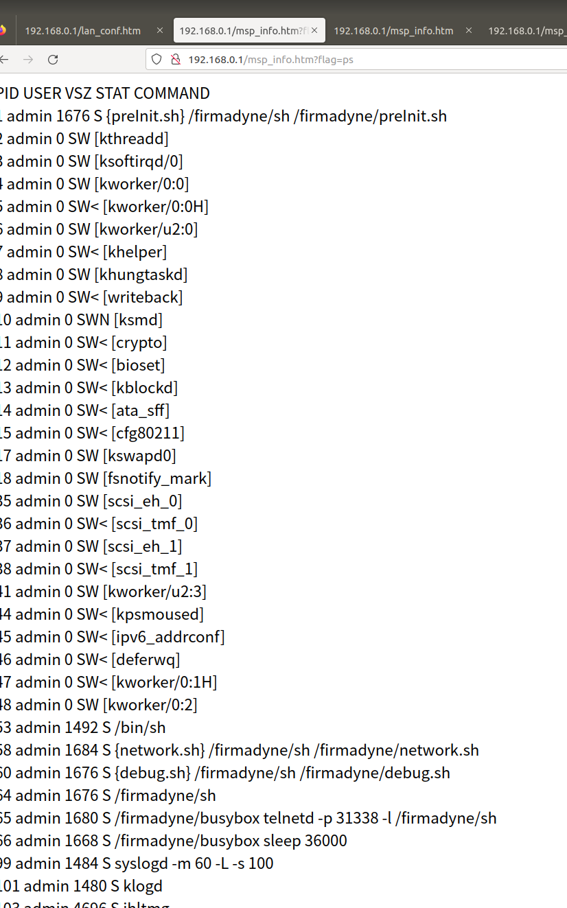
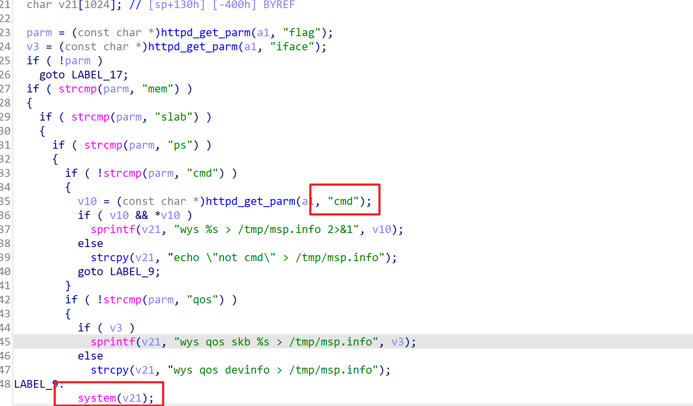
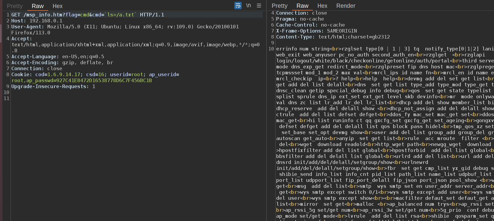
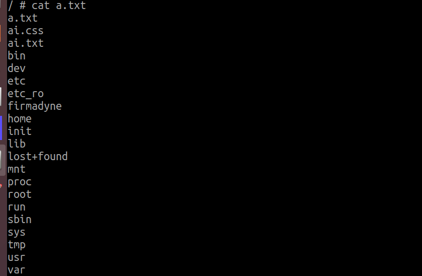

# DI_603WF_RCE
## Overview
Manufacturer's website:[http://www.dlink.com.cn/](http://www.dlink.com.cn/)
Firmware download website:[http://www.dlink.com.cn/techsupport/ProductInfo.aspx?m=DI-603WF](http://www.dlink.com.cn/techsupport/ProductInfo.aspx?m=DI-603WF)
## Affected version
18.11.22A1
## Vulnerability details
By analyzing the firmware, a potential RCE (Remote Code Execution) vulnerability was discovered on a webpage.

Upon locating the corresponding function, a dangerous parameter `cmd` was identified.

After constructing a payload, command execution was successfully achieved.

