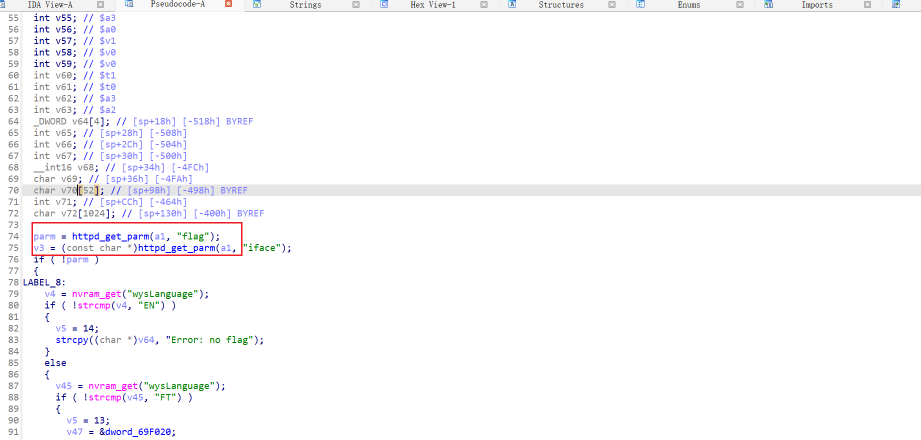
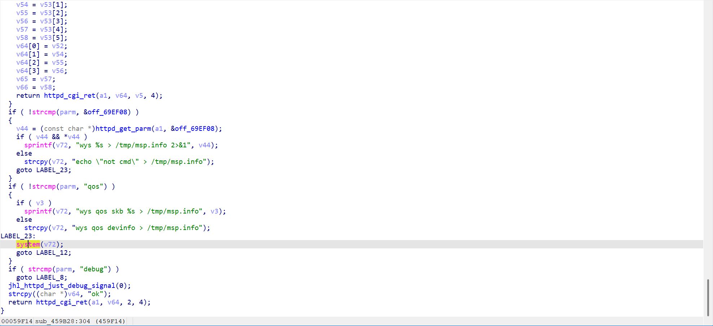
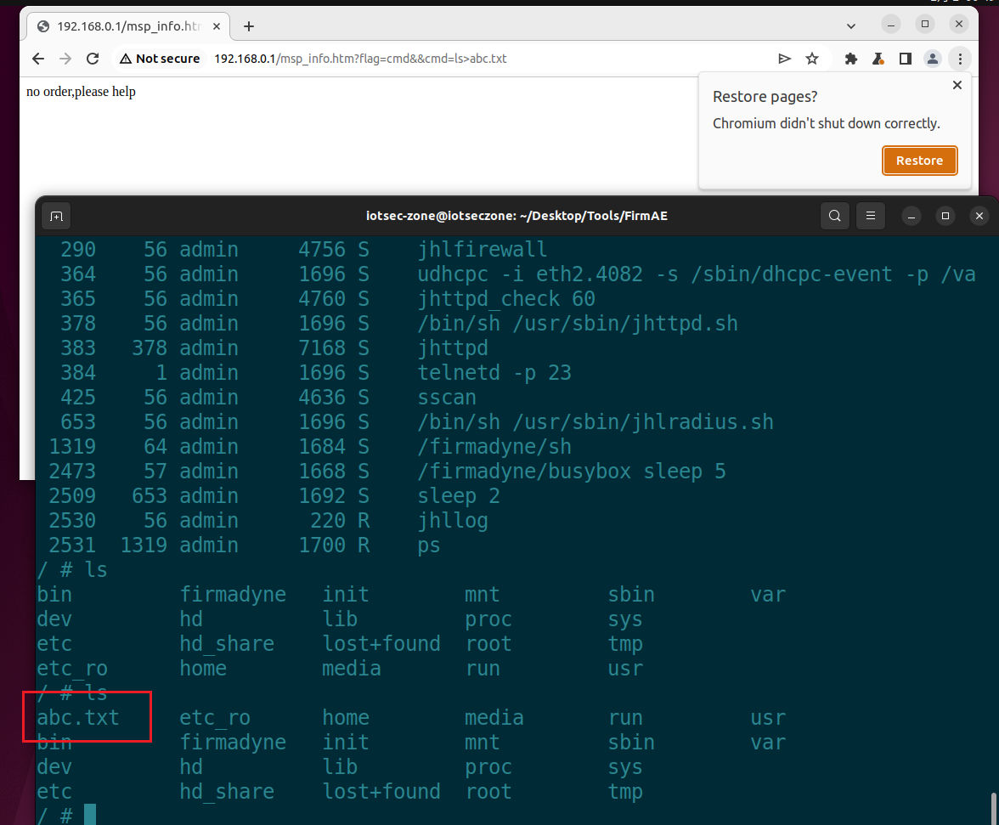

# DI_7001_MINI_5G RCE
## Overview
Manufacturer's website:[网址](http://www.dlink.com.cn)
Firmware download website:
## Affected version
19.10.31A1
## Vulnerability details
 **The analysis of the main program uncovered a code execution vulnerability in the `flag` parameter of `msp_info`, which can be exploited to run arbitrary commands.**  
 

**A command injection attack was carried out, exploiting the vulnerability to run unauthorized commands.**
