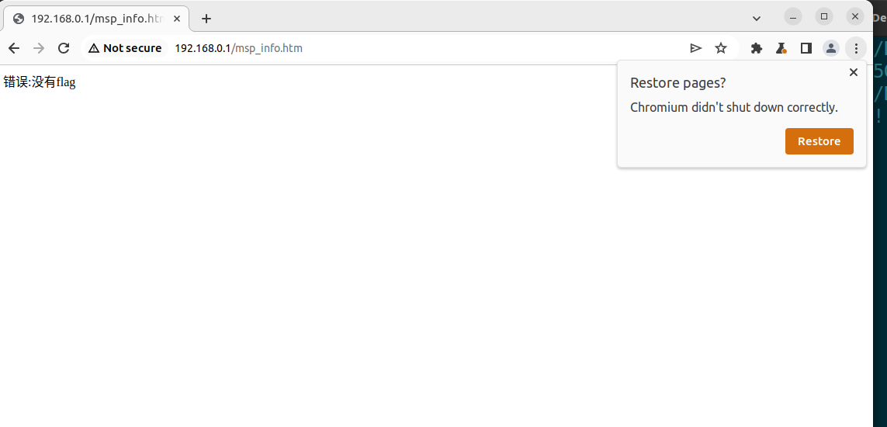
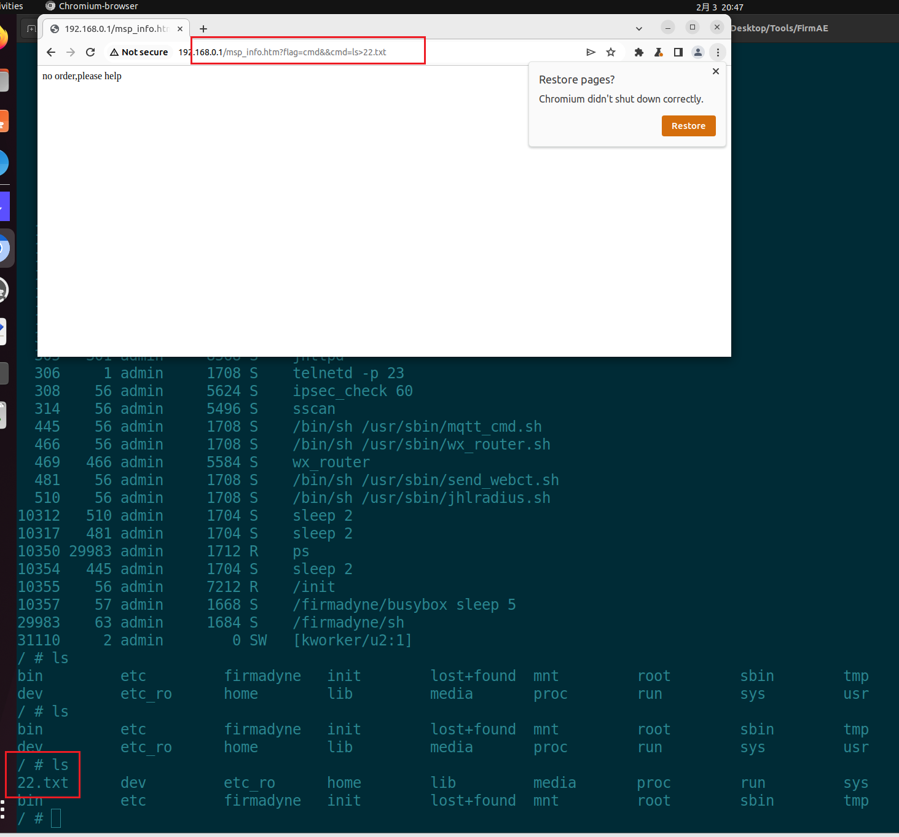

# DI_7001_MINI_8G_A1 RCE
## Overview
Manufacturer's website:[http://www.dlink.com.cn](http://www.dlink.com.cn)
Firmware download website:[https://www.dlink.com.cn/techsupport/ProductInfo.aspx?m=DI-7001MINI-8G](https://www.dlink.com.cn/techsupport/ProductInfo.aspx?m=DI-7001MINI-8G)
## Affected version
A1-19.09.19A1
## Vulnerability details 
An investigation of the main program revealed that the `flag` parameter in `msp_info` is vulnerable, allowing arbitrary code execution.

**Attempting command injection resulted in a successful attack leveraging the vulnerability.**

