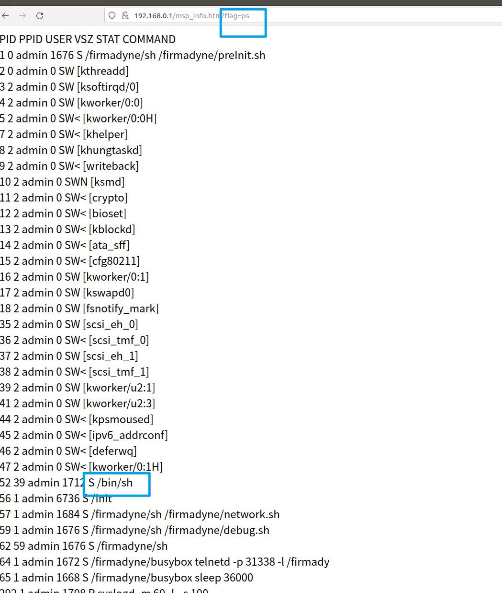
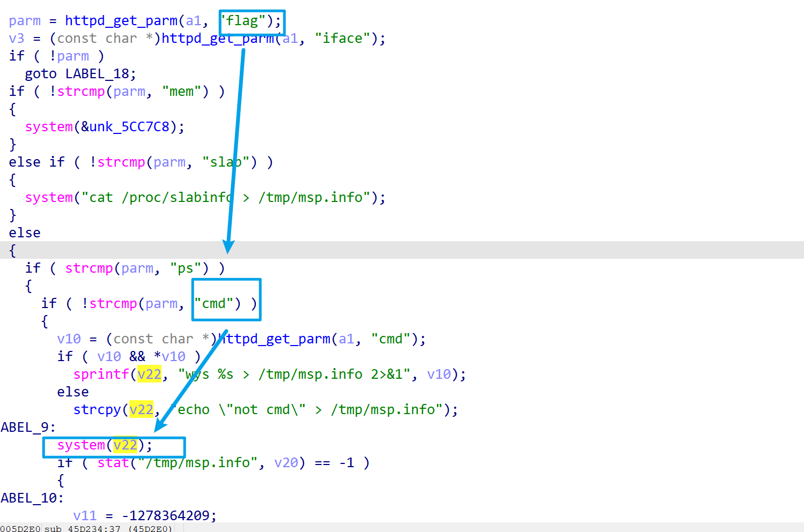
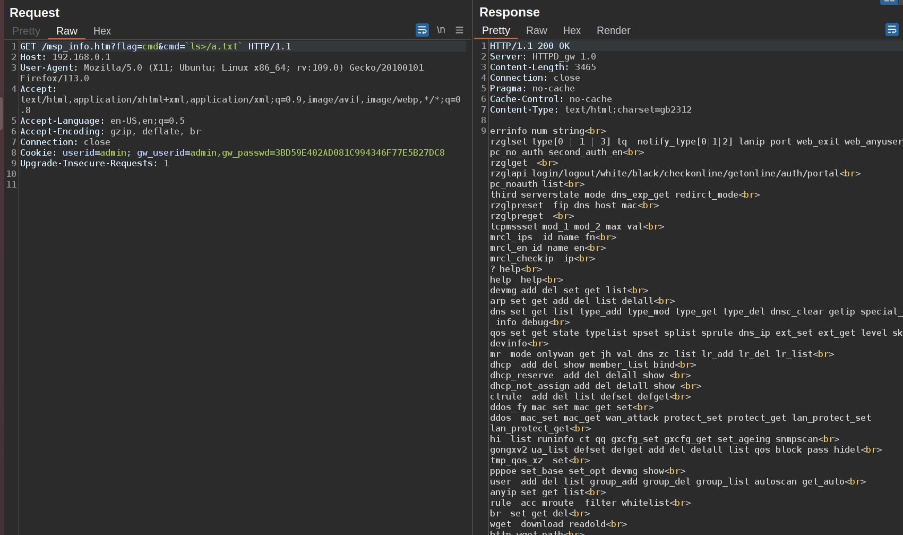
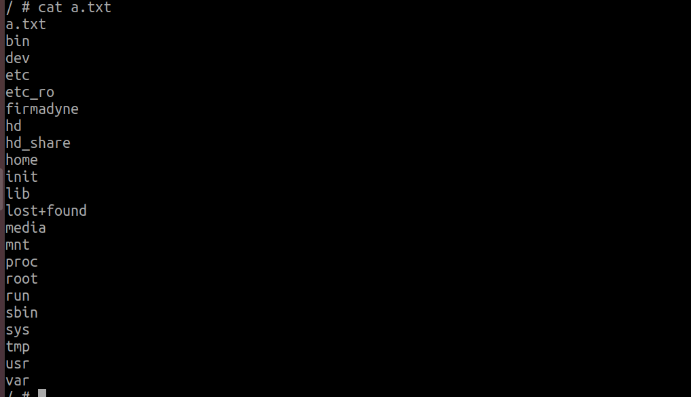

# DI_8003G_RCE
## Overview
Manufacturer's website:[http://www.dlink.com.cn/](http://www.dlink.com.cn/)
Firmware download website:http://www.dlink.com.cn/techsupport/ProductInfo.aspx?m=DI-8003G

## Affected version

19.12.10A1

## Vulnerability details
Through analyzing the firmware, I discovered a potential spot for command injection.

Upon locating the corresponding function, a dangerous parameter `cmd` was identified.

We attempt a command injection attack.

The result shows that the command execution was successful.

