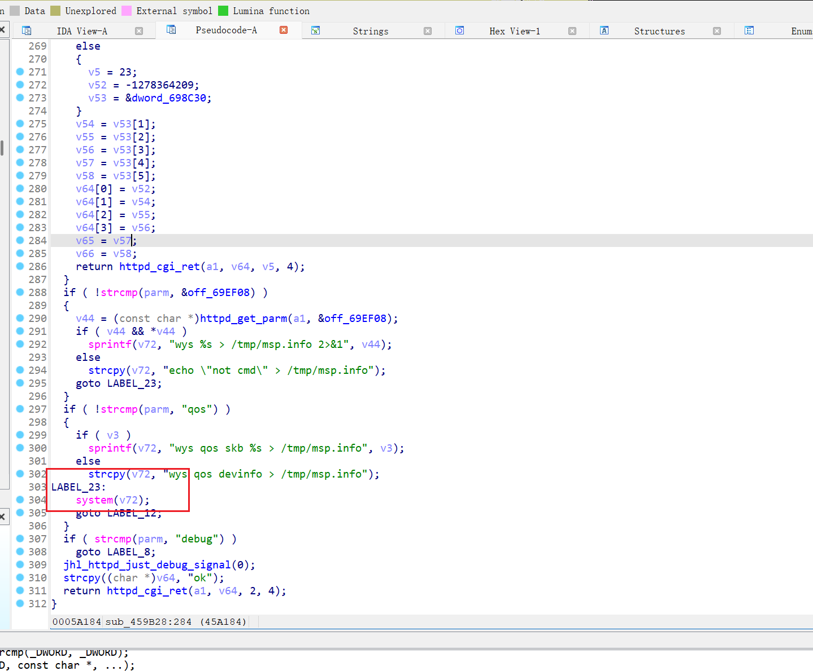
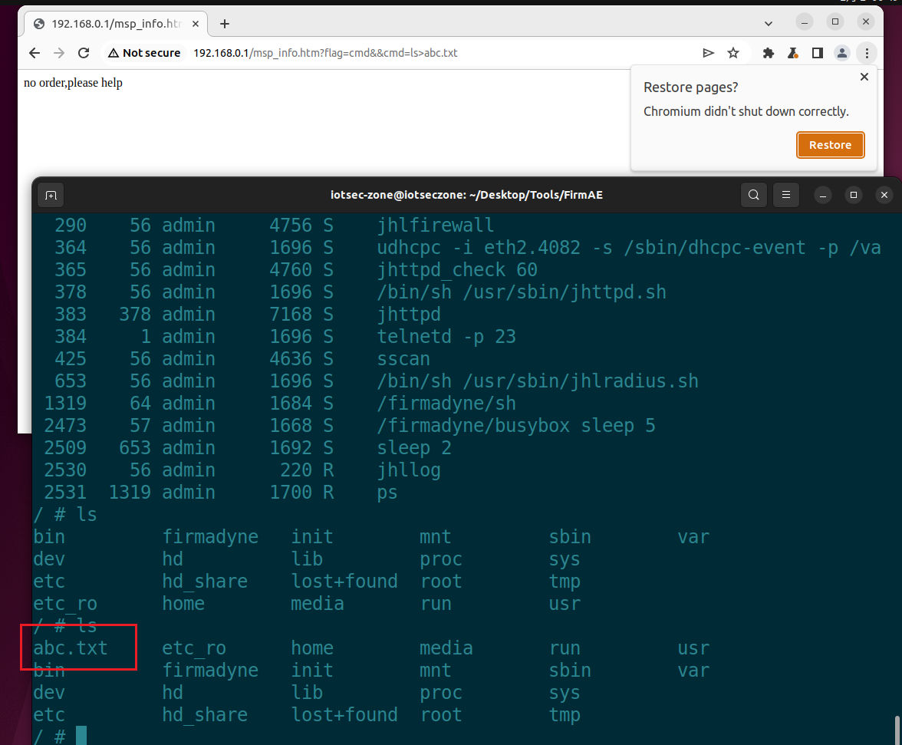

# DI_8100G RCE
## Overview
Manufacturer's website:[http://www.dlink.com.cn](http://www.dlink.com.cn)
Firmware download website[https://www.dlink.com.cn/techsupport/ProductInfo.aspx?m=DI-8100G](https://www.dlink.com.cn/techsupport/ProductInfo.aspx?m=DI-8100G)
## Affected version
17.12.20A1
## Vulnerability details
By analyzing the main program`jhttpd`, it was found that the `flag` parameter in `msp_info` could be exploited to execute arbitrary code.

**Command injection was tested and successfully exploited to execute arbitrary commands.**

